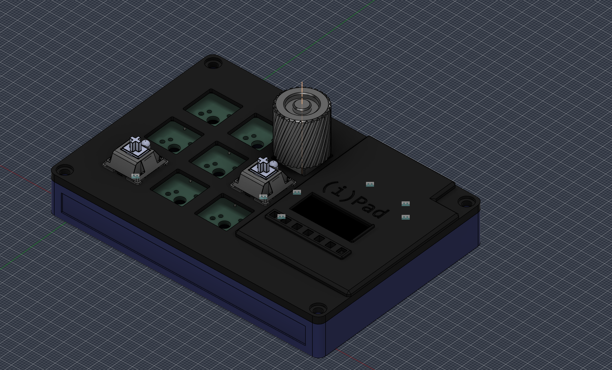
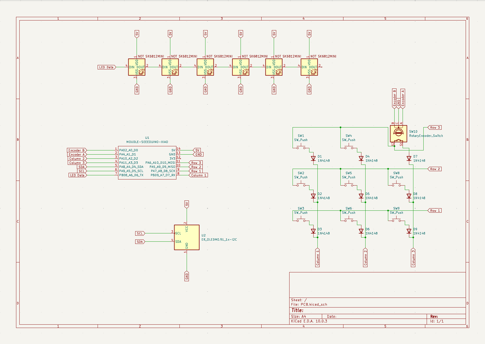
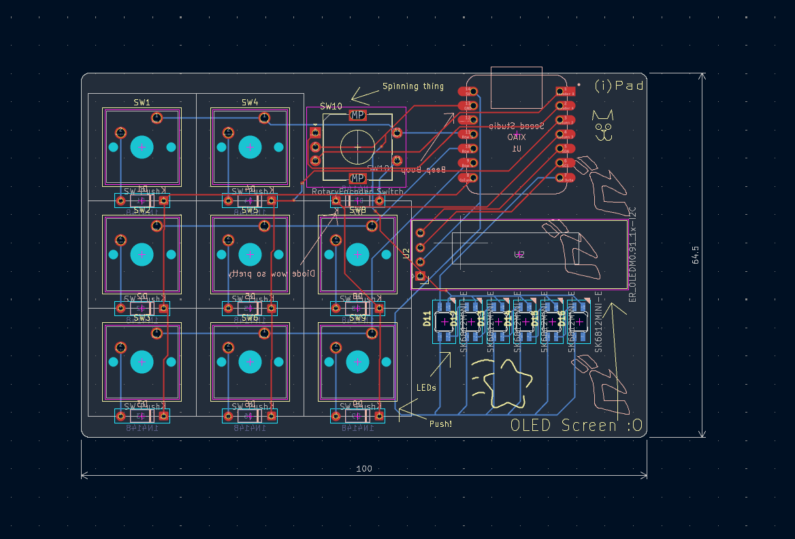

# (i)Pad
 ~~Trying to create a Hackpad.
 I'm new to this, so I'm just trying things out at this stage.~~  
 I created a Macropad. I figured it out :D  
 **I have completed the final version (v3). Please ignore the other versions.**

## What is the (i)Pad?
The (i)Pad is a Macropad built for productivity work. It was designed by me and 13 hours of my time. It runs on QMK firmware.

## What is included in the (i)Pad:
- 8 keys
- one rotary encoder
- one OLED display
- 6 LEDs
- updated the shell

(I may have to update the firmware once I get my hands on the physical keyboard)

## Firmware:
The keyboard will run on QMK firmware. It may be updated in the future (Once I get the parts).

## The Shell:
 

## The PCB:
 
 

## The Production files:
[(i)Pad production files](Production)

## This project took me around 13 hours and I'm glad it's (hopefully) done
I chose this project as a kind of first step into electronics and CAD.
I learned how to use KiCAD and create firmware and got better at Fusion. 
Overall a great project and I'm fairly happy with the result.
All that's left is to hopefully get this approved so I can get the parts to ship it. 

## BOM:
- 8x MX Switches
- 1x Rotary Encoder
- 6x LED
- 1x PCB
- 1x OLED screen
- 1x Shell
- 1x Plate
- 1x RP2040 controller
- 9x Diode

**Credits:**
 Used AI for basic questions about software and hardware
